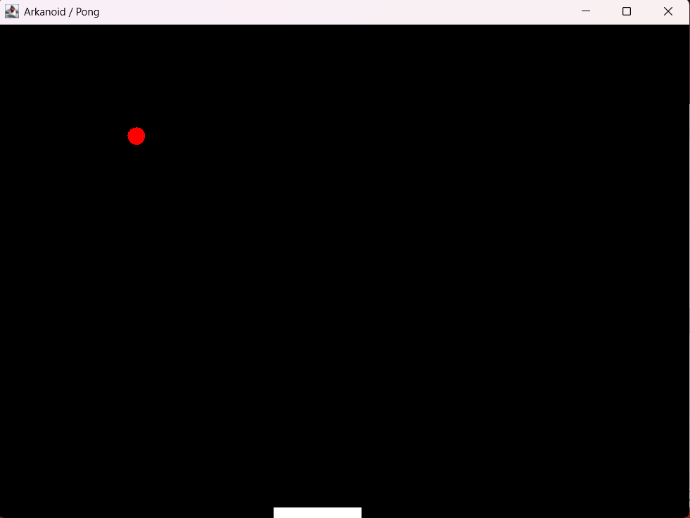

# ⚙️ Projekt Fizyka Odbijanie Paletki

    **EnvService** is a lightweight application configuration management system in PHP, supporting various data sources (`.env`, Redis, tables), built on the **Builder**, **Factory** and **Dependency Injection (Container)** patterns.
## Wykorzystanie fizyki
    Metoda kalkulująca punkt uderzenia relative do środka paletki (-1 do 1)
    Pomocnicza metoda do wykrywania kolizji (AABB z uwzględnieniem promienia)
## 📁 Struktury folderow

    src/
    ├── Model/         #akcje objektow ruchomych
    ├── Object/     # Objekty planszy
    GameWindow #glowny plik uruchamiający

## 🧰 Instalacja

     ./idea/arrtifacts/Fizyka_Projekt_jar mozna utworzyć tez plik exe

## 🧩 Przyklad

